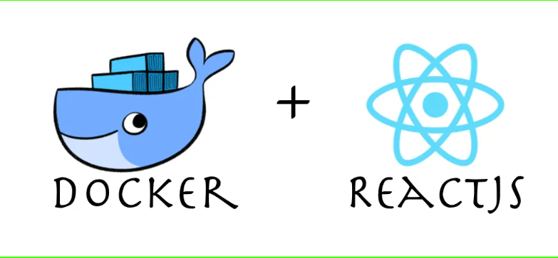

# Dockerizing a React App
#  
This repository provides a step-by-step guide and code examples for Dockerizing a React app. By containerizing your React application, you can achieve consistent development and seamless deployment across various environments.

## Prerequisites

Before getting started, ensure that you have the following prerequisites installed on your system:

- Node.js and npm (Node Package Manager)
- Basic familiarity with React and Docker concepts

## Instructions

Follow these steps to Dockerize your React app:

1. Clone or download this repository.
2. Set up the React app by running the command `npx create-react-app my-app` in your terminal and navigating into the newly created directory `my-app`.
3. Create a file named `Dockerfile` in the root directory of your React app and copy the provided Dockerfile contents into it.
4. Create a file named `.dockerignore` in the root directory of your React app and copy the provided `.dockerignore` contents into it.
5. Build the Docker image by running `docker build -t my-react-app .` in your terminal (make sure you are in the root directory of your React app).
6. Run the Docker container using the command `docker run -p 3000:3000 my-react-app`.
7. Access your React app by opening a browser and navigating to `http://localhost:3000`.

## Next Steps

If you want to further optimize your Dockerized React app, stay tuned for the upcoming blog post on exploring multi-stage builds with Docker. It will provide insights and practical examples on how to enhance your Docker image and streamline the deployment process.

Feel free to contribute to this repository by creating issues or submitting pull requests.
